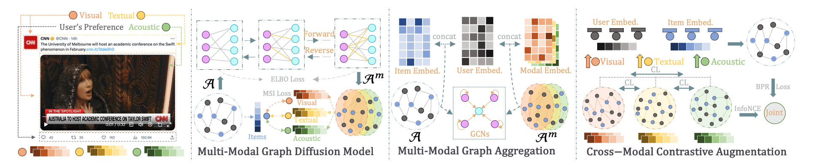
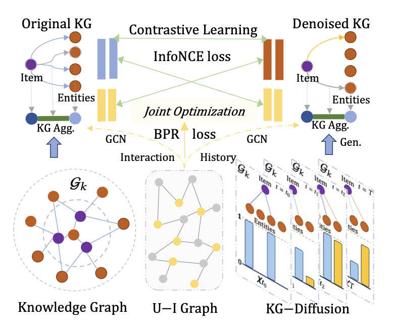
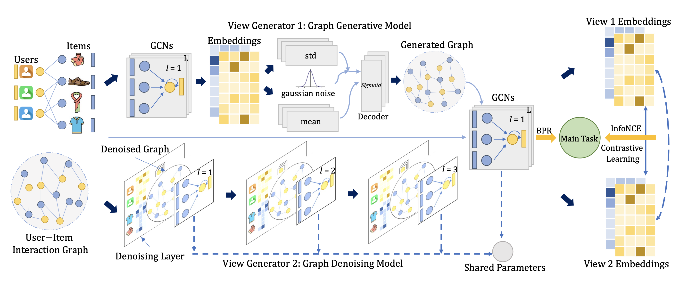

# 📝 Selected Publications 

( # indicates corresponding authorship.) 

ACM MM 2024 Oral

DiffMM: Multi-Modal Diffusion Model for Recommendation\\
<b>Yangqin Jiang</b>, Lianghao Xia, Wei Wei, Da Luo, Kangyi Lin,  Chao Huang#.  <a href="https://github.com/zj-jayzhang/Data-Free-Transfer-Attack">code</a> 

🏆 Best Paper Honourable Mention Award (7/1149)

WSDM 2024 Oral

DiffKG: Knowledge Graph Diffusion Model for Recommendation\\
<b>Yangqin Jiang</b>, Yuhao Yang, Lianghao Xia, Chao Huang#.  

🏆 Top-11 Most Cited Paper, 11st/112

SIGKDD 2023

Adaptive Graph Contrastive Learning for Recommendation\\
<b>Yangqin Jiang</b>, Chao Huang#, Lianghao Xia.   <a href="https://github.com/zj-jayzhang/Acc-DD/">code</a> 

🏆 Most Influential Paper, 10th/497

-  WWW 2024 &nbsp;PromptMM: Multi-Modal Knowledge Distillation for Recommendation with Prompt-Tuning, Wei Wei, Jiabin Tang, Lianghao Xia,  **Yangqin Jiang**, Chao Huang#. 
-  ICWS 2021 &nbsp;DGPF: A Dialogue Goal Planning Framework for Cognitive Service Conversational Bot, Bolin Zhang, Zhiying Tu, **Yangqin Jiang**, Shufan He, Guoqing Chao, Dianhui Chu, Xiaofei Xu. 

